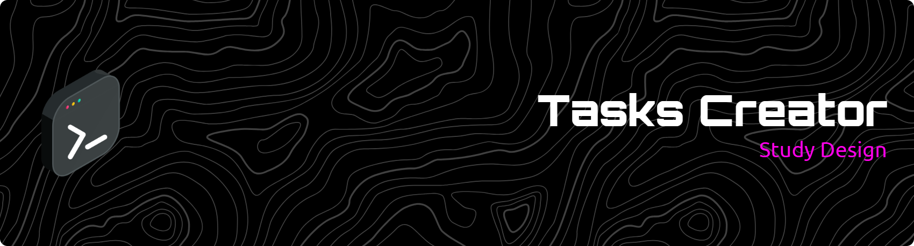

  

  
  
  
  
  

---
# 📜 ABOUT 📜
> [!NOTE]
> This is a simple application create for applying my personal study's involving basic concepts of Flask, APIs and CRUD. The focus of this project is developer my skills about Python, Flask, CRUD and APIs. The project itself is a very simple and don't require many steps for reproduce.

> [!IMPORTANT]
> Because it is a simple program and i'm still deepening my studys about ecosystem Python and backend, the application don't have a native DBA, this tasks being stored in a list. Basically the program is done for fun and knowlegde.
# 📖 CONCEPT 📖
> [!NOTE]
> The main project is focused in create tasks via requisitions HTTP, these tasks being anything(do a job, task, clean the house and etc..). You create tasks, solve them and update the status via requisitions(EX: Postman).
# 📂 DEPENDENCIES 📂

> [!IMPORTANT]
> ### Flask
> 
> ### Flask-SQAlchemy
> 
> ### Flask-Cors
> 
> ### Werkzeug
> 
> ### pytest

# 🛠️ HOW RECREATE THIS APPLICATION 🛠️

Follow the steps below for recreate this application in your local machine.

1. ### PRE-REQUIREMENTS 

   Confirm that you have a correct version of Python installed in your machine > Python 3.14.2. 
   
   If you not have installed that version, enter in the following link and follow the steps to have Python installed >> https://www.python.org/downloads/

   
   Type "python --version" or "python3 --version" in the Terminal after the installation for consult a version installed in your machine and certificate that version is correct.

2. ###  CLONE THIS REPOSITORY 

   Type in the Terminal "git clone https://github.com/Sera-DAI/tasks-creator.git" to clone this code in your machine. Certify that clone is inside of your directory of preference. Run "cd tasks-creator".

3. ### CREATE A DESKTOP ENVIRONMENT

    Run in your Terminal: "python -m venv .venv" > ".venv/Scripts/activate" or "python3 -m venv .venv" > "source .venv/bin/activate" depending of your OS(python3 for mac/linux).

4. ### INSTALL ALL DEPENDENCIES

   Install all libs necessary that are listed in fle "requirements.txt". Run "pip install -r requirements.txt"
   
# 📖 API DOCUMENTATION 📖

# 🖥️ USAGE 🖥️

For use this application, run the server in your machine and send requests for store tasks in list. Send more requests, update or delete... After the use, close the application for stop server.

>[!IMPORTANT]
> After the application is used and stoped, the informations contained in the list being deleted, REMEMBER THIS.
  
